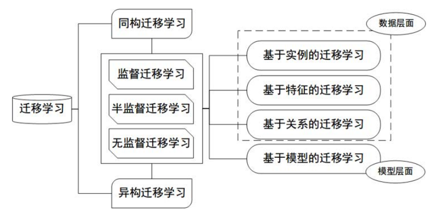
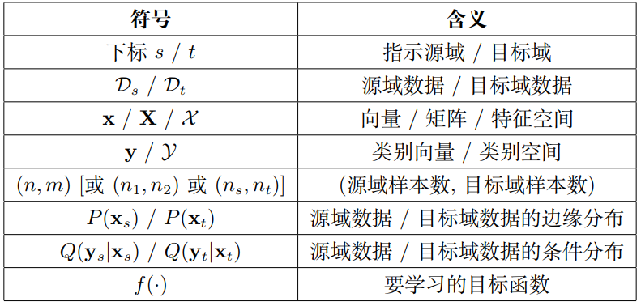
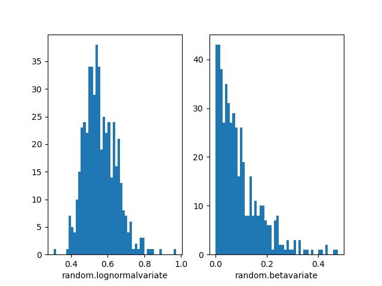
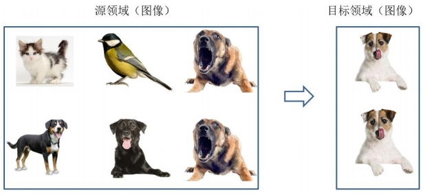
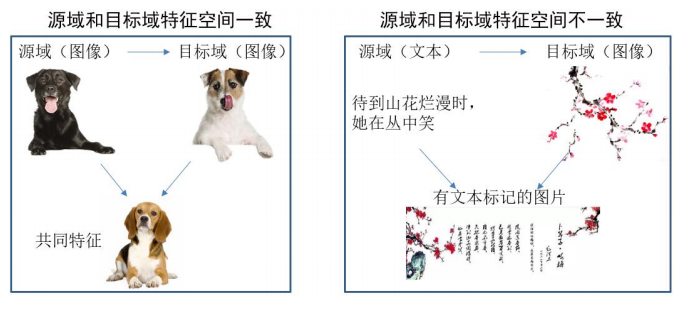
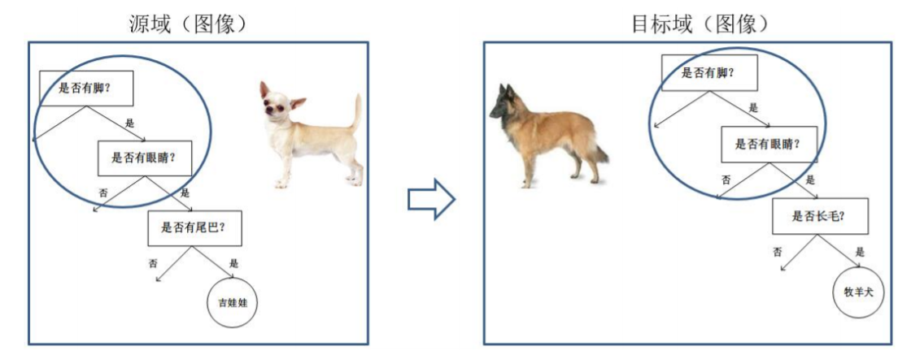
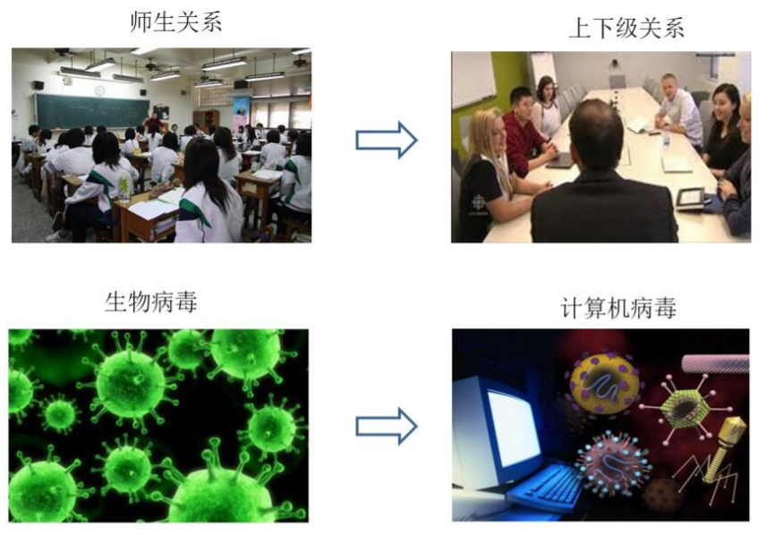
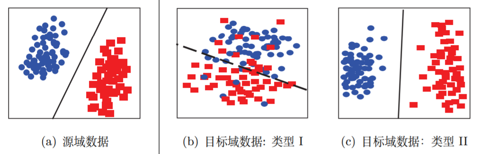

# 迁移学习概述 1~6 节

本篇文章是我自己对*王晋东*的[迁移学习简明手册](https://github.com/jindongwang/transferlearning)的一些摘记，其大部分内容都来自于这篇手册，还有一部分是从网上摘抄的。

[TOC]

## 1 迁移学习的基本概念

### 1.1 什么是迁移学习

迁移学习作为机器学习的一个重要分支，侧重于将已经学习过的知 识迁移应用于新的问题中。

迁移学习的核心问题是，找到新问题和原问题之间的相似性，才可以顺利地实现知识 的迁移。

**迁移学习**，是指利用数据、任务、或模型之间的相似性，将在旧领域学习过的模型，应用于 新领域的一种学习过程。

### 1.2 为什么我们需要迁移学习

简单的来说，是让机器拥有举一反三的能力，在目标类似的情况下，避免重新训练一个新的网络。

迁移学习的优点在于：

1. 避开了**大数据与少标注**之间的矛盾。通过寻找一些与目标数据相近的有标注的数据，从而利用这些数据来构建模型，增加我们目标数据的标注。
2. 不必从头开始训练自己的网络，可以讲成熟的模型迁移到我们自己的任务中，减少了对**计算**的需求。
3. 适应性更强，能拓展网络的适用范围

### 1.3 负迁移

当源域与目标域之前不存在什么相关性，就会产生负迁移，即在源域上学习到的知识，对于目标域上的学习产生负面作用。

## 2 迁移学习的研究领域



大体上讲，迁移学习的分类可以按照四个准则进行：按目标域**有无标签**分、按**学习方法**分、按**特征**分、按**离线与在线形式**分

### 2.1 按目标域标签分

依据目标领域有无标签，迁移学习可以分为以下三个大类：

1. 监督迁移学习 (Supervised Transfer Learning)

2. 半监督迁移学习 (Semi-Supervised Transfer Learning)

3. 无监督迁移学习 (Unsupervised Transfer Learning)

### 2.2 按学习方法分类

1. 基于*样本*的迁移学习方法 (Instance based Transfer Learning)
2. 基于*特征*的迁移学习方法 (Feature based Transfer Learning)
3. 基于*模型*的迁移学习方法 (Model based Transfer Learning)
4. 基于*关系*的迁移学习方法 (Relation based Transfer Learning)

- 基于*实例*的迁移，简单来说就是通过权重重用，对源域和目标域的样例进行迁移。就是 说直接对不同的样本赋予不同权重，比如说相似的样本，我就给它高权重，这样我就完成了 迁移，非常简单非常非常直接。
  $$
  \min \frac{1}{n} \sum_{i=1}^{n} w_{i} L\left(\mathbf{x}_{i}^{s}, y_{i}^{s}, \theta\right)
  $$

- 基于*特征*的迁移，就是更进一步对特征进行变换。意思是说，假设源域和目标域的特征 原来不在一个空间，或者说它们在原来那个空间上不相似，那我们就想办法把它们变换到 一个空间里面，那这些特征不就相似了？这个思路也非常直接。这个方法是用得非常多的， 一直在研究，目前是感觉是研究最热的。
  $$
  \min \frac{1}{n} \sum_{i=1}^{n} L\left(\phi\left(\mathbf{x}_{i}^{s}\right), \mathbf{y}_{i}^{s}, \theta\right)
  $$

- 基于*模型*的迁移，就是说构建参数共享的模型。这个主要就是在神经网络里面用的特 别多，因为神经网络的结构可以直接进行迁移。比如说神经网络最经典的 finetune 就是模 型参数迁移的很好的体现。 
  $$
  \min \frac{1}{n} \sum_{i=1}^{n} L\left(\mathbf{x}_{i}^{s}, y_{i}^{s}, \theta\right)
  $$

- 基于*关系*的迁移，这个方法用的比较少，这个主要就是说挖掘和利用关系进行类比迁 移。比如老师上课、学生听课就可以类比为公司开会的场景。这个就是一种关系的迁移。

目前最热的就是基于特征还有模型的迁移，然后基于实例的迁移方法和他们**结合**起来使用。

### 2.3 按特征分类

按照特征的属性进行分类

1. 同构迁移学习 (Homogeneous Transfer Learning)
2. 异构迁移学习 (Heterogeneous Transfer Learning)

如果特征语义和维度都相同，那么就是同构；反之，如果特 征完全不相同，那么就是异构。举个例子来说，不同图片的迁移，就可以认为是同构；而图 片到文本的迁移，则是异构的。

### 2.4 按离线与在线形式分

1. . 离线迁移学习 (Offline Transfer Learning)
2. 在线迁移学习 (Online Transfer Learning)

目前，绝大多数的迁移学习方法，都采用了离线方式。即，源域和目标域均是给定的， 迁移一次即可。这种方式的缺点是显而易见的：算法无法对新加入的数据进行学习，模型也 无法得到更新。与之相对的，是在线的方式。即随着数据的动态加入，迁移学习算法也可以 不断地更新。

## 3 迁移学习的应用

### 3.1 计算机视觉

同一类图片，不同的拍摄角度、不同 光照、不同背景，都会造成特征分布发生改变。因此，使用迁移学习构建跨领域的鲁棒分类 器是十分重要的。

### 3.2 文本分类

由于文本数据有其领域特殊性，因此，在一个领域上训练的分类器，不能直接拿来作用 到另一个领域上。这就需要用到迁移学习。例如，在电影评论文本数据集上训练好的分类器，不能直接用于图书评论的预测。这就需要进行迁移学习。

### 3.3 医疗健康

不同于其他领域，医疗领域研究的难点问题 是，无法获取足够有效的医疗数据。在这一领域，迁移学习同样也变得越来越重要。

我们可以预见到的是，迁移学习对于那些不易获取标注数据的领域，将会发挥越来越 重要的作用。

## 4 基础知识

### 4.1 迁移学习的问题形式化

在迁移学习中，有两个基本的概念： 领域 (Domain) 和任务 (Task)。

#### 4.1.1 领域

领域 (Domain): 是进行学习的主体。领域主要由两部分构成：数据和生成这些数据的 概率分布。通常我们用 D 表示一个 domain，用大写斜体 P 来表示一个概率分布。

特别地，因为涉及到迁移，所以对应于两个基本的领域：**源领域** (Source Domain) 和 目标领域 (Target Domain)。

领域上的数据，我们通常用 x 来表示，它也是向量的表示形式。例如，x<sub>i</sub> 就表示第 i 个样本或特征。用 X 表示一个领域的数据，这是一种矩阵形式。我们 用大写花体 X 来表示数据的特征空间。

通常我们用小写下标 s 和 t 来分别指代两个领域。结合领域的表示方式，则：D<sub>s</sub> 表示 源领域，D<sub>t</sub> 表示目标领域。

#### 4.1.2 任务

任务 (Task): 是学习的目标。任务主要由两部分组成：标签和标签对应的函数。通常我们用花体 Y 来表示一个标签空间，用 f(·) 来表示一个学习函数。

相应地，源领域和目标领域的类别空间就可以分别表示为 Y<sub>s</sub> 和 Y<sub>t</sub>。我们用小写 y<sub>s</sub> 和 y<sub>t</sub> 分别表示源领域和目标领域的实际类别。

#### 4.1.3 迁移学习

有了上面领域和任务的定义，我们就可以对迁移学习进行形式化。

迁移学习 (Transfer Learning): 给定一个有标记的源域 $\mathcal{D}_{s}=\left\{\mathbf{x}_{i}, y_{i}\right\}_{i=1}^{n}$ 和一个无 标记的目标域 $\mathcal{D}_{t}=\left\{\mathbf{x}_{j}\right\}_{j=n+1}^{n+m}$。这两个领域的数据分布 P(x<sub>s</sub>) 和 P(x<sub>t</sub>) 不同，即 $P\left(\mathbf{x}_{s}\right) \neq P(x_t)$。迁移学习的目的就是要借助 D<sub>s</sub> 的知识，来学习目标域 D<sub>t</sub> 的知识 (标签)。

更进一步，结合我们前面说过的迁移学习研究领域，迁移学习的定义需要进行如下的 考虑： 

1. 特征空间的异同，即 $X_s$ 和 $X_t$是否相等。
2. 类别空间的异同：即 $Y_s$ 和 $Y_t$ 是否相等。
3. 条件概率分布的异同：即 $Q_s(y_s|x_s)$ 和 $Q_t(y_t|x_t)$ 是否相等

结合上述形式化，我们给出**领域自适应 (Domain Adaptation)** 这一热门研究方向的定义：

领域自适应 (Domain Adaptation): 给定一个有标记的源域 $\mathcal{D}_{s}=\left\{\mathbf{x}_{i}, y_{i}\right\}_{i=1}^{n}$ 和一个无标记的目标域 $\mathcal{D}_{t}=\left\{\mathbf{x}_{j}\right\}_{j=n+1}^{n+m}$，假定他们的特征空间相同，即 $X_s=X_t$，且他们的类别空间也相同，即 $Y_s=Y_t$ 以及条件概率分布也相同，即 $Q_s(y_s|x_s)=Q_t(y_t|x_t)$。但是这两个域的边缘分布不同，即 $P\left(\mathbf{x}_{s}\right) \neq P(x_t)$。迁移学习的目标就是，利用有标记的数据 $D_s$ 去学习一个分类器 $f:x_t\rightarrow y_t$ 来预测目标域 $D_t$ 的标签 $\mathbf{y}_{t} \in \mathcal{Y}_{t}$ 



### 4.2 总体思路

迁移学习的核心是，找到源领域和目标领域之间的**相似性**，并加以合理利用。

找到相似性 (不变量)，是进行迁移学习的核心。 有了这种相似性后，下一步工作就是，如何度量和利用这种相似性。

**度量**工作的目标有两点：

1. 很好地度量两个领域的相似性，不仅定性地告诉我们它们是否相似，更定量地给出*相似程度*。
2. 以度量为准则，通过我们所要采用的学习手段，*增大*两个领域之间的*相似性*，从而完成迁移学习。

一句话总结： 相似性是核心，度量准则是重要手段。


### 4.3 度量准则

本质上就是找一个变换使得源域和目标域的距离最小（相似度最大）。

用一个简单的式子来表示，度量就是描述源域和目标域这两个领域的距离：

$$
DISTANCE(D_s,D_t)=DistanceMeasure(\cdot,\cdot)
$$

下面我们从**距离**和**相似度度量准则**几个方面进行简要介绍。

#### 4.3.1 常见的几种距离

1. **欧式距离**

   定义在两个向量 (空间中的两个点) 上：点 x 和点 y 的欧氏距离为：

$$
d_{\text {Euclidean }}=\sqrt{(\mathbf{x}-\mathbf{y})^{\top}(\mathbf{x}-\mathbf{y})}
$$

2. **闵可夫斯基距离**

   两个向量（点）的 p 阶距离：
$$
d_{\text {Minkowski }}=\left(\|\mathbf{x}-\mathbf{y}\|^{p}\right)^{1 / p}
$$

4. **马氏距离**

   定义在两个向量 (两个点) 上，这两个数据在同一个分布里。点 x 和点 y 的马氏距离 为：

$$
d_{\text {Mahalanobis }}=\sqrt{(\mathbf{x}-\mathbf{y})^{\top} \Sigma^{-1}(\mathbf{x}-\mathbf{y})}
$$
​    其中，$\Sigma$ 是这个分布的协方差

​    当 $\Sigma=I$ 时，马氏距离退化为欧式距离#

#### 4.3.2 相似度

1. **余弦相似度**

   衡量两个向量的相关性 (夹角的余弦)。向量 x, y 的余弦相似度为：

$$
\cos (\mathbf{x}, \mathbf{y})=\frac{\mathbf{x} \cdot \mathbf{y}}{|\mathbf{x}| \cdot|\mathbf{y}|}
$$

2. **互信息**

   定义在两个概率分布 X, Y 上，x ∈ X, y ∈ Y 。它们的互信息为：

$$
I(X ; Y)=\sum_{x \in X} \sum_{y \in Y} p(x, y) \log \frac{p(x, y)}{p(x) p(y)}
$$

3. **皮尔逊相关系数**

   衡量两个随机变量的相关性。随机变量 X, Y 的 Pearson 相关系数为：

$$
\rho_{X, Y}=\frac{\operatorname{Cov}(X, Y)}{\sigma_{X} \sigma_{Y}}
$$

​	 理解：协方差矩阵除以标准差之积。

​	 扩展：[−1, 1]，绝对值越大表示（正/负）相关性越大。

4. **Jaccard 相关系数**

   对两个集合 X, Y ，判断他们的相关性，借用集合的手段：

$$
J=\frac{X \cap Y}{X \cup Y}
$$

   理解：两个集合的交集除以并集。 

   扩展：Jaccard 距离 =1 − J。

#### 4.3.3 KL 散度与 JS 距离

KL 散度和 JS 距离是迁移学习中被广泛应用的度量手段。

1. KL 散度

   Kullback–Leibler divergence，又叫做*相对熵*，衡量两个概率分布 P(x), Q(x) 的距离：

$$
D_{K L}(P \| Q)=\sum_{i=1} P(x) \log \frac{P(x)}{Q(x)}
$$

   这是一个非对称距离：$D_{K L}(P \| Q) \neq D_{K L}(Q \| P)$。

2. JS 距离

   Jensen–Shannon divergence，基于 KL 散度发展而来，是对称度量：
$$
J S D(P \| Q)=\frac{1}{2} D_{K L}(P \| M)+\frac{1}{2} D_{K L}(Q \| M)
$$

   其中 $M=\frac{1}{2}(P+Q)$。

#### 4.3.4 最大均值差异 MMD

##### MMD 的基本概念

最大均值差异是迁移学习中**使用频率最高**的度量。Maximum mean discrepancy，它度量在再生希尔伯特空间中两个分布的距离，是一种*核学习*方法。两个随机变量的 MMD 平方距离为
$$
M M D(X, Y)=\left\|\frac{1}{n} \sum_{i=1}^{n} \phi\left(x_{i}\right)-\frac{1}{m} \sum_{j=1}^{m} \phi\left(y_{j}\right)\right\|_{H}^{2}
$$

其中 $ϕ(\cdot)$ 是映射，用于把原变量映射到*再生核希尔伯特空间* (Reproducing Kernel Hilbert Space, RKHS)。

x<sub>i</sub> 和 y<sub>j</sub> 为样本数量。

什么是 RKHS？简单来说希尔伯特空间是对于函数的内积完备的，而再生核希尔伯特空间是具有再生性 $\langle K(x, \cdot), K(y, \cdot)\rangle_{\mathcal{H}}=K(x, y)$ 的希尔伯特空间。就是比欧几里得空间更高端的。将平方展开后，RKHS 空间中的内积就可以转换成核函数，所以最终 MMD 可以<u>直接通过核函数进行计算</u>。

理解：就是求两堆数据在 RKHS 中的均值的距离

##### 为什么要用 MMD

Domain adaptation 的目的是将源域（Source domain）中学到的知识可以应用到不同但相关的目标域（Target domain）。

本质上是要找到一个**变换函数**，使得变换后的源域数据和目标域数据的距离是最小的。

所以这其中就要涉及如何度量两个域中**数据分布差异**的问题，因此也就用到了MMD。

##### MMD 的理论推导

MMD的关键在于如何找到一个合适的 $\phi()$ 来作为一个映射函数。但是这个映射函数可能在不同的任务中都不是固定的，并且这个映射可能高维空间中的映射，所以是很难去选取或者定义的。那如果不能知道 $\phi$，那MMD该如何求呢？我们先展开把MMD展开：
$$
M M D(X, Y)=\\
\left\|\frac{1}{n^{2}} \sum_{i}^{n} \sum_{i^{\prime}}^{n} \phi\left(x_{i}\right) \phi\left(x_{i}^{\prime}\right)-\frac{2}{n m} \sum_{i}^{n} \sum_{j}^{m} \phi\left(x_{i}\right) \phi\left(y_{j}\right)+\frac{1}{m^{2}} \sum_{j}^{m} \sum_{j^{\prime}}^{m} \phi\left(y_{j}\right) \phi\left(y_{j}^{\prime}\right)\right\|_{H}
$$
展开后就出现了 $\phi\left(x_{i}\right) \phi\left(x_{i}^{\prime}\right)$ 的形式，这样联系 SVM 中的核函数 $k(*)$ ，就可以跳过计算 $\phi$ 的部分，直接求 $k\left(x_{i}\right) k\left(x_{i}^{\prime}\right)$。所以 MMD 又可以表示为：
$$
M M D(X, Y)=\\
\left\|\frac{1}{n^{2}} \sum_{i}^{n} \sum_{i^{\prime}}^{n} k\left(x_{i}, x_{i}^{\prime}\right)-\frac{2}{n m} \sum_{i}^{n} \sum_{j}^{m} k\left(x_{i}, y_{j}\right)+\frac{1}{m^{2}} \sum_{j}^{m} \sum_{j^{\prime}}^{m} k\left(y_{j}, y_{j}^{\prime}\right)\right\|_{H}
$$
在大多数论文中（比如DDC, DAN），都是用高斯核函数 $k(u, v)=e^{\frac{-\|u-v\|^{2}}{\sigma}}$ 来做核函数，最主要的应该是高斯核可以映射无穷维空间。

##### MMD 的实现

在 TCA 中，引入了一个核矩阵方便计算
$$
\left[\begin{array}{ll}
K_{s, s} & K_{s, s} \\
K_{s, t} & K_{t, t}
\end{array}\right]
$$
以及L矩阵：
$$
l_{i, j}=\left\{\begin{array}{ll}
1 / n^{2}, & x_{i}, x_{j} \in D_{s} \\
1 / m^{2}, & x_{i}, x_{j} \in D_{s} \\
-1 / n m, & \text { otherwise }
\end{array}\right.
$$
在实际应用中，高斯核的 $\sigma$ 会取多个值，分别求核函数然后取和，作为最后的核函数。

##### MMD 代码解读

```python
import torch


def guassian_kernel(source, target, kernel_mul=2.0, kernel_num=5, fix_sigma=None):
    """
    将源域数据和目标域数据转化为核矩阵，即上文中的K
    Params
	    source: 源域数据（n * len(x))
	    target: 目标域数据（m * len(y))
	    kernel_mul:
	    kernel_num: 取不同高斯核的数量
	    fix_sigma: 不同高斯核的sigma值
	Return:
		sum(kernel_val): 多个核矩阵之和
    """
    n_samples = int(source.size()[0]) + int(target.size()[0])  # 求矩阵的行数，一般source和target的尺度是一样的，这样便于计算
    total = torch.cat([source, target], dim=0)  # 将source,target按列方向合并
    # 将total复制（n+m）份
    total0 = total.unsqueeze(0).expand(int(total.size(0)), int(total.size(0)), int(total.size(1)))
    # 将total的每一行都复制成（n+m）行，即每个数据都扩展成（n+m）份
    total1 = total.unsqueeze(1).expand(int(total.size(0)), int(total.size(0)), int(total.size(1)))
    # 求任意两个数据之间的和，得到的矩阵中坐标（i,j）代表total中第i行数据和第j行数据之间的l2 distance(i==j时为0）
    L2_distance = ((total0 - total1) ** 2).sum(2)
    # 调整高斯核函数的sigma值
    if fix_sigma:
        bandwidth = fix_sigma
    else:
        bandwidth = torch.sum(L2_distance.data) / (n_samples ** 2 - n_samples)
    # 以fix_sigma为中值，以kernel_mul为倍数取kernel_num个bandwidth值（比如fix_sigma为1时，得到[0.25,0.5,1,2,4]
    bandwidth /= kernel_mul ** (kernel_num // 2)
    bandwidth_list = [bandwidth * (kernel_mul ** i) for i in range(kernel_num)]
    # 高斯核函数的数学表达式
    kernel_val = [torch.exp(-L2_distance / bandwidth_temp) for bandwidth_temp in bandwidth_list]
    # 得到最终的核矩阵
    return sum(kernel_val)  # /len(kernel_val)


def mmd_rbf(source, target, kernel_mul=2.0, kernel_num=5, fix_sigma=None):
    '''
    计算源域数据和目标域数据的MMD距离
    Params:
	    source: 源域数据（n * len(x))
	    target: 目标域数据（m * len(y))
	    kernel_mul:
	    kernel_num: 取不同高斯核的数量
	    fix_sigma: 不同高斯核的sigma值
	Return:
		loss: MMD loss
    '''
    batch_size = int(source.size()[0])  # 一般默认为源域和目标域的batchsize相同
    kernels = guassian_kernel(source, target,
                              kernel_mul=kernel_mul, kernel_num=kernel_num, fix_sigma=fix_sigma)
    # 根据公式（7）将核矩阵分成4部分
    XX = kernels[:batch_size, :batch_size]
    YY = kernels[batch_size:, batch_size:]
    XY = kernels[:batch_size, batch_size:]
    YX = kernels[batch_size:, :batch_size]
    loss = torch.mean(XX + YY - XY - YX)
    return loss  # 因为一般都是n==m，所以L矩阵一般不加入计算
```

##### 代码示例

为了体现以上代码的有效性，我们参考[链接](https://blog.csdn.net/llh_1178/article/details/72889279)生成了两组不同分布的数据。

```python
import random
import matplotlib
import matplotlib.pyplot as plt

SAMPLE_SIZE = 500
buckets = 50

"""
对数正态分布是指一个随机变量的对数服从正态分布，则该随机变量服从对数正态分布。对数正态分布从短期来看，与正态分布非常接近。但长期来看，对数正态分布向上分布的数值更多一些。
"""
# 第一种分布：对数正态分布，得到一个中值为mu，标准差为sigma的正态分布。mu可以取任何值，sigma必须大于零。
plt.subplot(1, 2, 1)  # 生成带有子图像的图，第一个参数代表子图的行数；第二个参数代表该行图像的列数； 第三个参数代表每行的第几个图像。
plt.xlabel("random.lognormalvariate")  # 设置x轴的标签文本
mu = -0.6
sigma = 0.15  # 将输出数据限制到0-1之间
res1 = [random.lognormvariate(mu, sigma) for _ in
        range(1, SAMPLE_SIZE)]  # for _ in range()的 _ 是一个循环标志，在下面的循环中不会用到，相当于 i
plt.hist(res1, buckets)  # 绘制直方图

# 第二种分布：beta分布。参数的条件是alpha 和 beta 都要大于0， 返回值在0~1之间。
plt.subplot(1, 2, 2)
plt.xlabel("random.betavariate")
alpha = 1
beta = 10
res2 = [random.betavariate(alpha, beta) for _ in range(1, SAMPLE_SIZE)]  # for _ in range()的 _ 是一个循环标志，在下面的循环中不会用到，相当于 i
plt.hist(res2, buckets)

plt.savefig('data.jpg')
plt.show()
```

两种数据分布如下图

两种分布有明显的差异，下面从两个方面**用 MMD 来量化**这种差异：

1. 分别从**不同分布**取两组数据（每组为10\*500）

```python
from torch.autograd import Variable
import torch

# 参数值见上段代码
# 分别从对数正态分布和beta分布取两组数据
diff_1 = []
for i in range(10):
    diff_1.append([random.lognormvariate(mu, sigma) for _ in range(1, SAMPLE_SIZE)])

diff_2 = []
for i in range(10):
    diff_2.append([random.betavariate(alpha, beta) for _ in range(1, SAMPLE_SIZE)])

X = torch.Tensor(diff_1)
Y = torch.Tensor(diff_2)
X, Y = Variable(X), Variable(Y)
print(mmd_rbf(X, Y))
```

输出结果为

```python
tensor(6.1824)
```

2. 分别从**相同分布**取两组数据（每组为10\*500）

```python
from torch.autograd import Variable

#参数值见以上代码
#从对数正态分布取两组数据
same_1 = []
for i in range(10):
    same_1.append([random.lognormvariate(mu, sigma) for _ in range(1, SAMPLE_SIZE)])

same_2 = []
for i in range(10):
    same_2.append([random.lognormvariate(mu, sigma) for _ in range(1, SAMPLE_SIZE)])

X = torch.Tensor(same_1)
Y = torch.Tensor(same_2)
X,Y = Variable(X), Variable(Y)
print(mmd_rbf(X,Y))
```

输出结果为

```python
tensor(0.6187)
```

可以明显看出同分布数据和不同分布数据之间的**差距被量化**了出来，且符合之前理论所说：不同分布 MMD 的值大于相同分布 MMD 的值。
**PS**，在实验中发现一个问题，就是取数据时要在0-1的范围内取，不然MMD就失效了。

#### 4.3.5 Principal Angle

略

#### 4.3.6 A-distance

略

#### 4.3.7 Hilbert-Schmidt Independence Criterion

略

#### 4.3.8 Wasserstein Distance

略

### 4.4 迁移学习的理论保证

略

## 5 迁移学习的基本方法

迁移学习的基本方法可以分为四种。

这四种基本的方法分别是：

1. 基于样本的迁移
2. 基于模型的迁移
3. 基于特征的迁移
4. 及基于关系的迁移

### 5.1 基于样本迁移

基于样本的迁移学习方法 (Instance based Transfer Learning) 根据一定的*权重生成规则*，对数据样本进行*重用*。

例如下图中，源域中存在不同种类的动物，如狗、鸟、猫等，目标域只有狗这一种类别。

在迁移时，为 最大限度地和目标域相似，我们可以人为地**提高**源域中属于狗这个类别的**样本权重**。



虽然实例权重法具有较好的理论支撑、容易推导泛化误差上界，但这类方法通常只在*领域间分布差异较小*时有效，因此对自然语言处理、计算机视觉等任务效果并不理想。

而基于特征表示的迁移学习方法效果更好，是我们研究的重点。

### 5.2 基于特征迁移

基于特征的迁移方法 (Feature based Transfer Learning) 是指将通过**特征变换**的方式**互相迁移**，来减少源域和目标域之间的差距；或者将源域和目标域的数据特征变换到**统一特征空间**中，然后利用传统的机器学习方法进行分类识别。

根据特征的同构和异构性，又可以分为*同构*和*异构*迁移学习。



基于特征的迁移学习方法是迁移学习领域中**最热门**的研究方法。

这类方法通常假设源域和目标域间有一些**交叉的特征**。

常见的方法有：

1. *迁移成分分析方法* (Transfer Component Analysis, TCA)

   该方法的核心内容是以最大均值差异（MMD）作为度量准则，将不同数据领域中的*分布差异最小化*。

2. *基于结构对应*的学习方法 (Structural Corresponding Learning, SCL)

   该算法可以通过映射将一个空间中<u>独有的一些特征</u>变换到其他所有空间中的<u>轴特征</u>上，然后在该特征上使用*机器学习的算法*进行分类预测。

3. 在最小化分布距离的同时，加入实例选择的迁移联合匹配 (Tranfer Joint Matching, TJM) 方法

   将实例和特征迁移学习方法进行了有机的结合

4. 对于源域和目标域各自训练不同 的变换矩阵，从而达到迁移学习的目标。

近年来，基于特征的迁移学习方法大多与**神经网络**进行**结合**，在神经网络的训练中进行学习特征和模型的迁移。

在<u>下一小节</u>中，讲详细介绍这类方法。

### 5.3 基于模型迁移

基于模型的迁移方法 (Parameter/Model based Transfer Learning) 是指从源域和目标域中找到他们之间*共享的参数信息*，以实现迁移的方法。

这种迁移方式要求的假设条件是：源域中的数据与目标域中的数据可以共享一些模型的参数。



目前绝大多数基于模型的迁移学习方法都与深度神经网络进行结合，这些方法对现有的一些神经网络结构进行修改，在网络中加入**领域适配层**，然后联合进行训练。因此，这些方法也可以看作是基于模型、特征的方法的结合。

### 5.4 基于关系迁移

基于关系的迁移学习方法 (Relation Based Transfer Learning) 与上述三种方法具有截然不同的思路。这种方法比较关注源域和目标域的<u>样本之间的关系</u>。



## 6 第一类方法：数据分布自适应

数据分布自适应 (Distribution Adaptation) 是一类**最常用**的迁移学习方法。

这种方法 的**基本思想**是，由于源域和目标域的数据概率分布不同，那么最直接的方式就是通过一些变换，将不同的数据分布的距离拉近

下图介绍了几种数据分布的情况。简单来说，数据的边缘分布不同，就是数据整体不相似。数据的条件分布不同，就是数据整体相似，但是具体到每个类里，都不太相似。



根据数据分布的性质，这类方法又可以分为

1. 边缘分布自适应
2. 条件分布自适应
3. 联合分布自适应

### 6.1 边缘分布自适应

#### 6.1.1 基本思路

边缘分布自适应方法 (Marginal Distribution Adaptation) 的目标是减小源域和目标域的<u>边缘概率分布的距离</u>，从而完成迁移学习。即：
$$
\operatorname{DISTANCE}\left(\mathcal{D}_{s}, \mathcal{D}_{t}\right) \approx\left\|P\left(\mathbf{x}_{s}\right)-P\left(\mathbf{x}_{t}\right)\right\|
$$
边缘分布自适应方法适用于上图中由 图(a) 迁移到 图(b) 的情形

#### 6.1.2 核心方法

**迁移成分分析** (Transfer Component Analysis，**TCA**)

TCA 的思想：

1. 由于 $P(X_s)\ne P(X_t)$，因此，直接减小二者之间的距离是不可行的。
2. TCA 假设存在一个**特征映射 ϕ**，使得映射后数据的分布 $P(ϕ(x_s)) ≈ P(ϕ(x_t))$。
3. TCA 假设如果边缘分布接近，那么两个领域的条件分布也会接近， 即条件分布 $P(y_s|ϕ(x_s))) ≈ P(y_t |ϕ(x_t)))$ 

因此，我们现在的目标就是找到这个合适的 $\phi$

**具体实现**：

​		TCA 利用了 MMD（最大均值差异），我们令 n<sub>1</sub>，n<sub>2</sub> 分别表示源域和目标域的*样本个数*，那么它们之间的 MMD 距离可以计算为：
$$
D I S T A N C E\left(\mathbf{x}_{s}, \mathbf{x}_{t}\right)=\left\|\frac{1}{n_{1}} \sum_{i=1}^{n_{1}} \phi\left(\mathbf{x}_{i}\right)-\frac{1}{n_{2}} \sum_{j=1}^{n_{2}} \phi\left(\mathbf{x}_{j}\right)\right\|_{\mathcal{H}}
$$
​		MMD 的作用是求映射后源域和目标域的*均值之差*

​		我们可以发现，上面这个 MMD 距离平方展开后，有二次项乘积的部分，联系 SVM（支持向量机） 中的核函数，我们将一个难求的映射以核函数的形式来求，于是 TCA引入了核矩阵 K：
$$
\left[\begin{array}{ll}
K_{s, s} & K_{s, s} \\
K_{s, t} & K_{t, t}
\end{array}\right]
$$
​		以及一个 MMD 矩阵 L，它的每个元素的计算方式为：
$$
l_{i, j}=\left\{\begin{array}{ll}
1 / n^{2}, & x_{i}, x_{j} \in D_{s} \\
1 / m^{2}, & x_{i}, x_{j} \in D_{s} \\
-1 / n m, & \text { otherwise }
\end{array}\right.
$$
​		这样做的好处是，直接把这个难求的 $\phi$，变换成了下面的形式
$$
tr(KL)-\lambda tr(K)
$$
​		其中，$tr(\cdot)$ 的操作表示求矩阵的迹（矩阵对角线元素的和）

​		上述内容属于数学中的*半定规划*（SDP）的问题，解决起来非常耗时。

​		下面是**优化算法**：

​		用降维的方法构造结果，用一个更低维度的矩阵 W：
$$
\widetilde{\mathbf{K}}=\left(\mathbf{K K}^{-1 / 2} \widetilde{\mathbf{W}}\right)\left(\widetilde{\mathbf{W}}^{\top} \mathbf{K}^{-1 / 2} \mathbf{K}\right)=\mathbf{K} \mathbf{W} \mathbf{W}^{\top} \mathbf{K}
$$
​		这里的 W 矩阵是比 K 更低维度的矩阵。最后的 W 就是问题的解答了。

​		所以 TCA 最后的**优化目标**是：
$$
\begin{array}{ll}
\min _{\mathbf{W}} & \operatorname{tr}\left(\mathbf{W}^{\top} \mathbf{K L K} \mathbf{W}\right)+\mu \operatorname{tr}\left(\mathbf{W}^{\top} \mathbf{W}\right) \\
\text { s.t. } & \mathbf{W}^{\top} \mathbf{K H K} \mathbf{W}=\mathbf{I}_{m}
\end{array}
$$
​		这里的 H 是一个中心矩阵，$\mathbf{H}=\mathbf{I}_{n_{1}+n_{2}}-1 /\left(n_{1}+n_{2}\right) \mathbf{1 1}^{\top}$

​		上面公式的 min 的目标是<u>最小化源域和目标域的距离</u>，加上 W 的约束让它不能太复杂

​		而下面的公式要实现：<u>维持各自的数据特征</u>（即数据的散度）

**总结一下步骤**：

1. 输入两个特征矩阵，我们首先计算 L 和 H 
2. 选择常用的核函数（如高斯核、线性核）进行映射计算 K
3. 求 $(\mathbf{K L K}+\mu \mathbf{I})^{-1} \mathbf{K H K}$ 的前 m 个特征值
4. 得到源域和目标域的降维后的数据，用传统机器学习的方法进行运算

### 6.2 条件分布自适应

条件分布自适应方法 (Conditional Distribution Adaptation) 的目标是减小源域和目标域的<u>条件概率分布的距离</u>，从而完成迁移学习。

从形式上来说，条件分布自适应方法是用 $P(y_s|x_s)$ 和 $P(y_t |x_t)$之间的距离来近似两个领域之间的差异。即：
$$
D I S T A N C E\left(\mathcal{D}_{s}, \mathcal{D}_{t}\right) \approx\left\|P\left(y_{s} \mid \mathbf{x}_{s}\right)-P\left(y_{t} \mid \mathbf{x}_{t}\right)\right\|
$$
条件分布自适应对应于上图中由 图(a) 迁移到 图(c) 的情形。

略

### 6.3 联合分布自适应

略

### 6.4 动态分布自适应

略

## 7 第二类方法：特征选择

略

## 8 第三类方法：子空间学习

略
