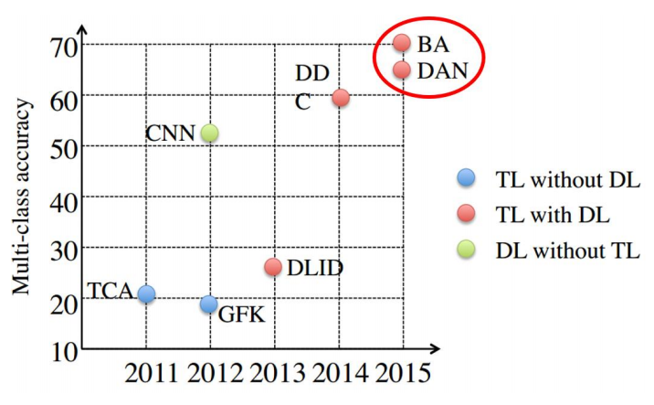

# 迁移学习概述 9~12 节

## 9 深度迁移学习

对比传统的非深度迁移学习方法，深度迁移学习直接提升了在不同任务上的学习效果。

由于深度学习直接对原始数据进行学习，所以其对比非深度方法还有两个**优势**：自动化地*提取*更具表现力的*特征*，以及满足了实际应用中的*端到端 (End-to-End) 需求*。

深度迁移学习方法 (BA、DDC、DAN) 对比传统迁移学习方法 (TCA、GFK 等)，在 精度上具有无可匹敌的优势。

### 9.1 深度网络的可迁移性

深度网络前面几层都学习到的是*通用的特征*（general feature）；随着网络层次的加深，后面的网络更偏重于学习任务*特定的特征*（specific feature）。

由实验可知，随着可迁移层数的增加，模型性能下降。但是，*前 3 层*仍然还是可以迁移的！同时，与随机初始化所有权重比较，迁移学习的精度是很高的!

### 9.2 最简单的深度迁移：finetune

Finetune，也叫微调、finetuning，是深度学习中的一个重要概念。简而言之，finetune 就是利用别人已经训练好的网络，针对自己的任务再进行调整。

#### 9.2.1 为什么需要已经训练好的网络

从头开始训练一个神经网络是非常*耗时*的，而且*消耗的资源*也是非常巨大的

#### 9.2.2 finetune 的优势

1. 不需要针对新任务从头开始训练网络，节省了时间成本
2. 预训练好的模型通常都是在大数据集上进行的，无形中扩充了我们的训练数据，使得 模型*更鲁棒*、*泛化能力更好*
3. Finetune 实现简单，使得我们只关注自己的任务即可

## 9.3 深度网络自适应

### 9.3.1 基本思路

finetune 有它的先天不足：它无法处理训练数据和测试数据*分布不同*的情况。

所以我们需要**自适应层**，来完成源域和目标域数据的自适应。自适应能够使得源域和目标域的数据分布更加接近，从而使得网络的效果更好。

深度网络的自适应主要完成：

1. 判断*哪些层*可以自适应，这决定了网络的*学习程度*
2. 判断采用什么样的*自适应方法 (度量准则*)，这决定了网络的*泛化能力*。

深度网络中最重要的是**网络损失的定义**。绝大多数深度迁移学习方法都采用了以下的 损失定义方式：
$$
\ell=\ell_{c}\left(\mathcal{D}_{s}, \mathbf{y}_{s}\right)+\lambda \ell_{A}\left(\mathcal{D}_{s}, \mathcal{D}_{t}\right)
$$
​		其中，ℓ 表示网络的*最终损失*，$ℓ_c(D_s, y_s)$ 表示网络在有标注的数据 (大部分是源域) 上的*常规分类损失* (这与普通的深度网络完全一致)

​		$ℓ_A(D_s, D_t)$ 表示网络的*自适应损失*。

​		最后一部分是传统的深度网络所不具有的、迁移学习所独有的。式中的 $λ$ 是权衡两部分的*权重参数*。

上述的分析指导我们设计深度迁移网络的**基本准则**：决定自适应层，然后在这些层加 入自适应度量，最后对网络进行 finetune。

#### 9.3.2 核心方法

**DaNN**(Domain Adaptive Neural Network）：

DaNN 的结构异常简单，它仅由两层神经元组成：*特征层*和*分类器层*，并在特征层后加入了一项 *MMD 适配层*，用来计算源域和目标域的距离

但是，由于网络太浅，表征能力有限，故无法很有效地解决领域适配的问题

略

## 9.4 深度对抗网络迁移

### 9.4.1 基本思路

**GAN**：

​		一共包括两个部分：一部分为生成网络 (Generative Network)，此部分负责生成尽可能地以假乱真的样本，这部分被成为*生成器* (Generator)；另一部分为判别网络 (Discriminative Network)，此部分负责判断样本是真实的，还是由生成器生成的，这部分被成为*判别器* (Discriminator)。 生成器和判别器的互相博弈，就完成了对抗训练。

​		GAN 的目标很明确：生成训练样本。这似乎与迁移学习的大目标有些许出入。然而， 由于在迁移学习中，天然地存在一个源领域，一个目标领域，因此，我们可以免去生成样本的过程，而<u>直接将其中一个领域的数据 (通常是目标域) 当作是生成的样本</u>。此时，生成器的职能发生变化，不再生成新样本，而是扮演了*特征提取*的功能：不断学习领域数据的特征，<u>使得判别器无法对两个领域进行分辨</u>。这样，原来的生成器也可以称为*特征提取器* (Feature Extractor)。

​		通常用 $G_f$ 来表示特征提取器，用 $G_d$ 来表示判别器。

​		与深度网络自适应迁移方法类似，深度对抗网络的**损失**也由两部分构成：网络训练的 损失 $ℓ_c$ 和领域判别损失 $ℓ_d$：
$$
\ell=\ell_{c}\left(\mathcal{D}_{s}, \mathbf{y}_{s}\right)+\lambda \ell_{d}\left(\mathcal{D}_{s}, \mathcal{D}_{t}\right)
$$

#### 9.4.2 核心方法

##### 1. **DANN**(Domain-Adversarial Neural Network)

​		DANN网络的学习目标是：生成的特征尽可能帮助区分两个领域的特征，同时使得判别器无法对两个领域的差异进行判别。

​		该方法的*领域对抗损失函数*表示为：
$$
\ell_{d}=\max \left[-\frac{1}{n} \sum_{i=1}^{n} \mathcal{L}_{d}^{i}(\mathbf{W}, \mathbf{b}, \mathbf{u}, z)-\frac{1}{n^{\prime}} \sum_{i=n+1}^{N} \mathcal{L}_{d}^{i}(\mathbf{W}, \mathbf{b}, \mathbf{u}, z)\right]
$$
​		其中的 $L_d$ 表示为
$$
\mathcal{L}_{d}\left(G_{d}\left(G_{f}\left(\mathbf{x}_{i}\right)\right), d_{i}\right)=d_{i} \log \frac{1}{G_{d}\left(G_{f}\left(\mathbf{x}_{i}\right)\right)}+\left(1-d_{i}\right) \log \frac{1}{G_{d}\left(G_{f}\left(\mathbf{x}_{i}\right)\right)}
$$