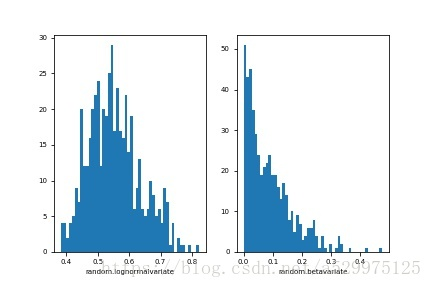

# 迁移学习概述

[TOC]

## 1 为什么我们需要迁移学习

简单的来说，是让机器拥有举一反三的能力，在目标类似的情况下，避免重新训练一个新的网络。

迁移学习的优点在于：

1. 减少了对**数据**集的要求，通过迁移学习修改的网络不像传统的网络一样需要大量的数据集才能得到一个较好的结果和精度。
2. 网络的适应性更强，能适用于更多的领域。
3. 目标域的数据不需要标签，可以实现无监督学习。

## 2 基本概念

### 2.1 域

源域 $\rightarrow$ 目标域

迁移学习要做的就是把一个网络从源域迁移到目标域上。

### 2.2 共同性

迁移学习可以发现源域和目标域之间的共同性。

### 2.3 公式

#### 传统的深度学习 Traditional deep learning

$$
\min \frac{1}{n} \sum_{i=1}^{n} L\left(x_{i}, y_{i}, \theta\right)
$$

#### 特征的适应 Feature adaptation

$$
\min \frac{1}{n} \sum_{i=1}^{n} L\left(\phi\left(\mathbf{x}_{i}^{s}\right), \mathbf{y}_{i}^{s}, \theta\right)
$$

即尽量将源域和特征域的**特征提取**到同一个特征空间里，让他们对齐，以得到更好的性能

也是**最常用的方法**，其他的适应方法基本会变为小技巧出现在论文里。

#### 实例的适应 Instance adaptation

$$
\min \frac{1}{n} \sum_{i=1}^{n} w_{i} L\left(\mathbf{x}_{i}^{s}, y_{i}^{s}, \theta\right)
$$

源域和目标域肯定存在一些**样本是类似的**（比如说数据集里的图片是类似的），那么我们在训练的时候就尽量将这些样本的**权重调大**。

#### 模型的适应 Model adaptation

也是**参数**的适应
$$
\min \frac{1}{n} \sum_{i=1}^{n} L\left(\mathbf{x}_{i}^{s}, y_{i}^{s}, \theta\right)
$$

### 2.4 MMD loss

#### MMD 的基本概念

MMD（Maximum Mean Discrepancy）是迁移学习，尤其是域适应（Domain adaptation）中使用最广泛的一种**损失函数**，主要用来度量两个不同但相关的分布的距离。
$$
M M D(X, Y)=\left\|\frac{1}{n} \sum_{i=1}^{n} \phi\left(x_{i}\right)-\frac{1}{m} \sum_{j=1}^{m} \phi\left(y_{j}\right)\right\|_{H}^{2}
$$
其中 H 表示这个距离是由 $\phi()$ 将数据映射到再生希尔伯特空间（RKHS）中进行度量的。

#### 为什么要用 MMD

Domain adaptation 的目的是将源域（Source domain）中学到的知识可以应用到不同但相关的目标域（Target domain）。

本质上是要找到一个**变换函数**，使得变换后的源域数据和目标域数据的距离是最小的。

所以这其中就要涉及如何度量两个域中**数据分布差异**的问题，因此也就用到了MMD。

#### MMD 的理论推导

MMD的关键在于如何找到一个合适的 $\phi()$ 来作为一个映射函数。但是这个映射函数可能在不同的任务中都不是固定的，并且这个映射可能高维空间中的映射，所以是很难去选取或者定义的。那如果不能知道 $\phi$，那MMD该如何求呢？我们先展开把MMD展开：
$$
M M D(X, Y)=\\
\left\|\frac{1}{n^{2}} \sum_{i}^{n} \sum_{i^{\prime}}^{n} \phi\left(x_{i}\right) \phi\left(x_{i}^{\prime}\right)-\frac{2}{n m} \sum_{i}^{n} \sum_{j}^{m} \phi\left(x_{i}\right) \phi\left(y_{j}\right)+\frac{1}{m^{2}} \sum_{j}^{m} \sum_{j^{\prime}}^{m} \phi\left(y_{j}\right) \phi\left(y_{j}^{\prime}\right)\right\|_{H}
$$
展开后就出现了 $\phi\left(x_{i}\right) \phi\left(x_{i}^{\prime}\right)$ 的形式，这样联系 SVM 中的核函数 $k(*)$ ，就可以跳过计算 $\phi$ 的部分，直接求 $k\left(x_{i}\right) k\left(x_{i}^{\prime}\right)$。所以 MMD 又可以表示为：
$$
M M D(X, Y)=\\
\left\|\frac{1}{n^{2}} \sum_{i}^{n} \sum_{i^{\prime}}^{n} k\left(x_{i}, x_{i}^{\prime}\right)-\frac{2}{n m} \sum_{i}^{n} \sum_{j}^{m} k\left(x_{i}, y_{j}\right)+\frac{1}{m^{2}} \sum_{j}^{m} \sum_{j^{\prime}}^{m} k\left(y_{j}, y_{j}^{\prime}\right)\right\|_{H}
$$
在大多数论文中（比如DDC, DAN），都是用高斯核函数 $k(u, v)=e^{\frac{-\|u-v\|^{2}}{\sigma}}$ 来做核函数，最主要的应该是高斯核可以映射无穷维空间。

#### MMD 的实现

在TCA中，引入了一个核矩阵方便计算
$$
\left[\begin{array}{ll}
K_{s, s} & K_{s, s} \\
K_{s, t} & K_{t, t}
\end{array}\right]
$$
以及L矩阵：
$$
l_{i, j}=\left\{\begin{array}{ll}
1 / n^{2}, & x_{i}, x_{j} \in D_{s} \\
1 / m^{2}, & x_{i}, x_{j} \in D_{s} \\
-1 / n m, & \text { otherwise }
\end{array}\right.
$$
在实际应用中，高斯核的 $\sigma$ 会取多个值，分别求核函数然后取和，作为最后的核函数。

#### 代码解读

```python
import torch

def guassian_kernel(source, target, kernel_mul=2.0, kernel_num=5, fix_sigma=None):
    '''
    将源域数据和目标域数据转化为核矩阵，即上文中的K
    Params: 
	    source: 源域数据（n * len(x))
	    target: 目标域数据（m * len(y))
	    kernel_mul: 
	    kernel_num: 取不同高斯核的数量
	    fix_sigma: 不同高斯核的sigma值
	Return:
		sum(kernel_val): 多个核矩阵之和
    '''
    n_samples = int(source.size()[0])+int(target.size()[0])# 求矩阵的行数，一般source和target的尺度是一样的，这样便于计算
    total = torch.cat([source, target], dim=0)#将source,target按列方向合并
    #将total复制（n+m）份
    total0 = total.unsqueeze(0).expand(int(total.size(0)), int(total.size(0)), int(total.size(1)))
    #将total的每一行都复制成（n+m）行，即每个数据都扩展成（n+m）份
    total1 = total.unsqueeze(1).expand(int(total.size(0)), int(total.size(0)), int(total.size(1)))
    #求任意两个数据之间的和，得到的矩阵中坐标（i,j）代表total中第i行数据和第j行数据之间的l2 distance(i==j时为0）
    L2_distance = ((total0-total1)**2).sum(2) 
    #调整高斯核函数的sigma值
    if fix_sigma:
        bandwidth = fix_sigma
    else:
        bandwidth = torch.sum(L2_distance.data) / (n_samples**2-n_samples)
    #以fix_sigma为中值，以kernel_mul为倍数取kernel_num个bandwidth值（比如fix_sigma为1时，得到[0.25,0.5,1,2,4]
    bandwidth /= kernel_mul ** (kernel_num // 2)
    bandwidth_list = [bandwidth * (kernel_mul**i) for i in range(kernel_num)]
    #高斯核函数的数学表达式
    kernel_val = [torch.exp(-L2_distance / bandwidth_temp) for bandwidth_temp in bandwidth_list]
    #得到最终的核矩阵
    return sum(kernel_val)#/len(kernel_val)

def mmd_rbf(source, target, kernel_mul=2.0, kernel_num=5, fix_sigma=None):
    '''
    计算源域数据和目标域数据的MMD距离
    Params: 
	    source: 源域数据（n * len(x))
	    target: 目标域数据（m * len(y))
	    kernel_mul: 
	    kernel_num: 取不同高斯核的数量
	    fix_sigma: 不同高斯核的sigma值
	Return:
		loss: MMD loss
    '''
    batch_size = int(source.size()[0])#一般默认为源域和目标域的batchsize相同
    kernels = guassian_kernel(source, target,
        kernel_mul=kernel_mul, kernel_num=kernel_num, fix_sigma=fix_sigma)
    #根据式（3）将核矩阵分成4部分
    XX = kernels[:batch_size, :batch_size]
    YY = kernels[batch_size:, batch_size:]
    XY = kernels[:batch_size, batch_size:]
    YX = kernels[batch_size:, :batch_size]
    loss = torch.mean(XX + YY - XY -YX)
    return loss#因为一般都是n==m，所以L矩阵一般不加入计算
```

#### 代码示例

为了体现以上代码的有效性，我们参考[链接](https://blog.csdn.net/llh_1178/article/details/72889279)生成了两组不同分布的数据。

```python
import random
import matplotlib
import matplotlib.pyplot as plt

SAMPLE_SIZE = 500
buckets = 50

#第一种分布：对数正态分布，得到一个中值为mu，标准差为sigma的正态分布。mu可以取任何值，sigma必须大于零。
plt.subplot(1,2,1)
plt.xlabel("random.lognormalvariate")
mu = -0.6
sigma = 0.15#将输出数据限制到0-1之间
res1 = [random.lognormvariate(mu, sigma) for _ in xrange(1, SAMPLE_SIZE)]
plt.hist(res1, buckets)

#第二种分布：beta分布。参数的条件是alpha 和 beta 都要大于0， 返回值在0~1之间。
plt.subplot(1,2,2)
plt.xlabel("random.betavariate")
alpha = 1
beta = 10
res2 = [random.betavariate(alpha, beta) for _ in xrange(1, SAMPLE_SIZE)]
plt.hist(res2, buckets)

plt.savefig('data.jpg)
plt.show()
```

两种数据分布如下图

两种分布有明显的差异，下面从两个方面用MMD来量化这种差异：

1. 分别从不同分布取两组数据（每组为10\*500）

```python
from torch.autograd import Variable

#参数值见上段代码
#分别从对数正态分布和beta分布取两组数据
diff_1 = []
for i in range(10):
    diff_1.append([random.lognormvariate(mu, sigma) for _ in xrange(1, SAMPLE_SIZE)])

diff_2 = []
for i in range(10):
    diff_2.append([random.betavariate(alpha, beta) for _ in xrange(1, SAMPLE_SIZE)])

X = torch.Tensor(diff_1)
Y = torch.Tensor(diff_2)
X,Y = Variable(X), Variable(Y)
print mmd_rbf(X,Y)
```

输出结果为

```python
Variable containing:
 6.1926
[torch.FloatTensor of size 1]
```

2. 分别从相同分布取两组数据（每组为10\*500）

```python
from torch.autograd import Variable

#参数值见以上代码
#从对数正态分布取两组数据
same_1 = []
for i in range(10):
    same_1.append([random.lognormvariate(mu, sigma) for _ in xrange(1, SAMPLE_SIZE)])

same_2 = []
for i in range(10):
    same_2.append([random.lognormvariate(mu, sigma) for _ in xrange(1, SAMPLE_SIZE)])

X = torch.Tensor(same_1)
Y = torch.Tensor(same_2)
X,Y = Variable(X), Variable(Y)
print mmd_rbf(X,Y)
```

输出结果为

```python
Variable containing:
 0.6014
[torch.FloatTensor of size 1]
```

可以明显看出同分布数据和不同分布数据之间的差距被量化了出来，且符合之前理论所说：不同分布MMD的值大于相同分布MMD的值。
**PS**，在实验中发现一个问题，就是取数据时要在0-1的范围内取，不然MMD就失效了。